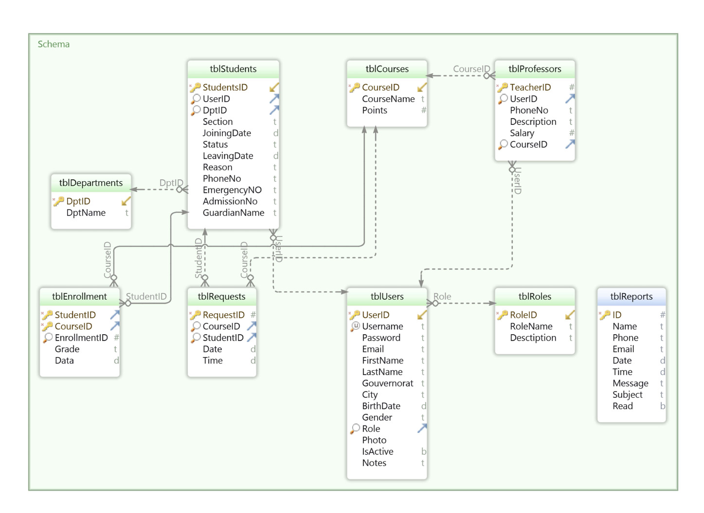
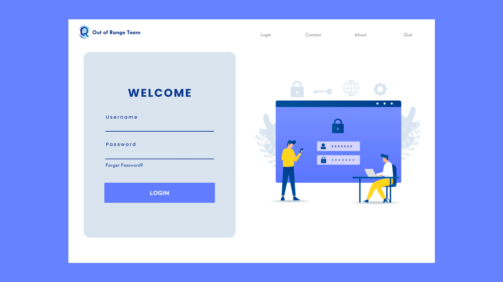
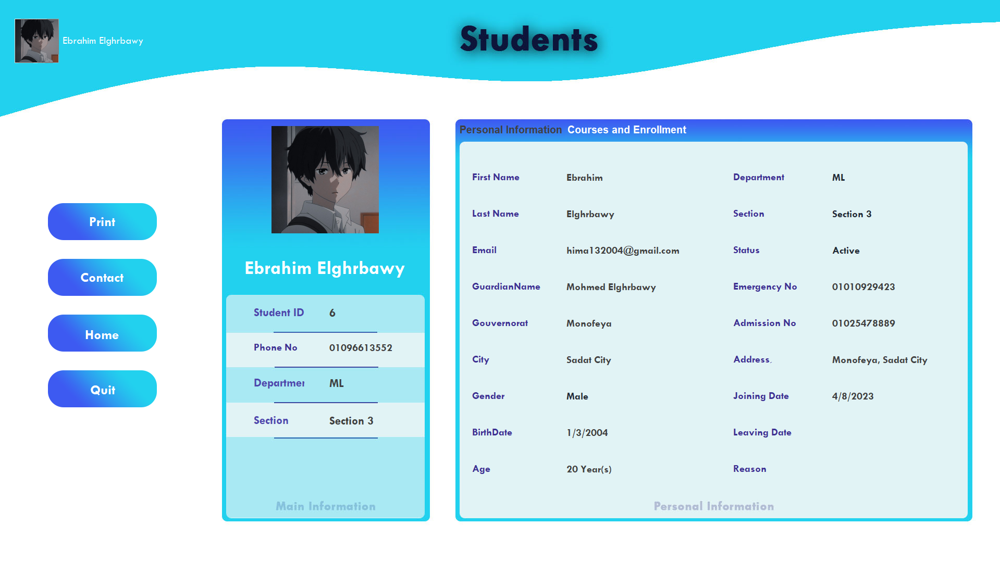
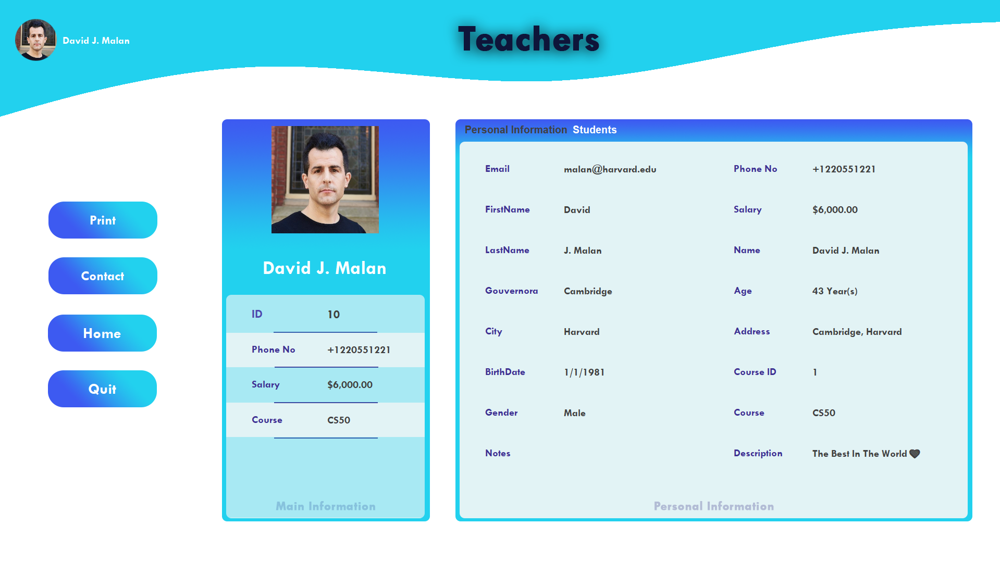
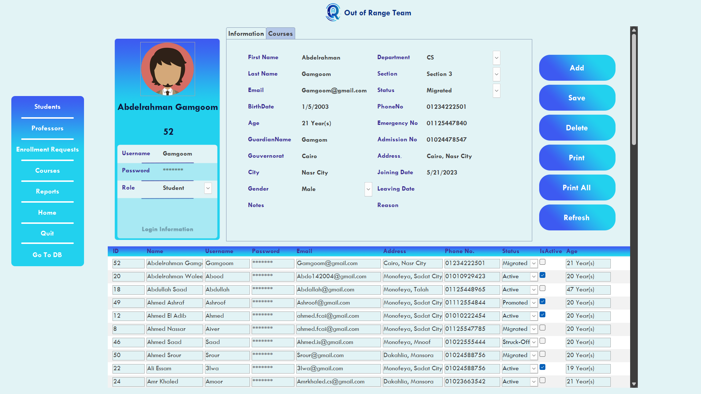

# Intro to db project using MS-Access

### make your screen settings like this:
	Display resolution : 1920 * 1080
	Scale : 125
For a better experience of displaying the interfaces and forms in Project.

[Demo video](https://www.facebook.com/100037358990879/videos/1110798976545957/)

## DB Schema

## Login Page

## Student Page

## Professor Page

## Admin Page

